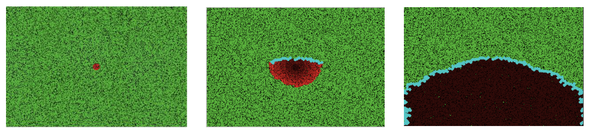

# Forest fire model

## Description
Our model simulates a forest fire. The model is implemented by a so-called cellular automaton. Each cell in the automaton is represented by one of the following objects:
- Tree (green cell)
- Extinguished environment (blue cell)
- Fire (red cell)
- "Smouldering ash" (embers) (cell spectrum from red to dark red)
- Empty space (black cell)

The spread of fire is influenced by the following adjustable parameters:
- Forest density
- Wind direction
- Wind speed
- Extinguishing strategy

Fire spread is further influenced by hidden parameters inside the model:
- Radius (size) of the initial fire
- Probability of fire spread without wind
- Base frequency of fire spread (once in X iterations of the model the fire will spread)
- Extinguishing frequency (once in X iterations, extinguishing will take place)
- Size of area covered by extinguishment (1 hour of water)
- Initial time at which extinguishing starts

## Report
Our model describing the spread of fire is affected by the assumptions we put into it. However, we have backed these assumptions up with the occurrences of fires in our physical world. The first of our assumptions is that fire is influenced by wind, specifically such that fire spreads in the direction of the wind (link to an article describing this). This assumption is implemented in our model by the fact that fire spreading in the opposite direction has a reduced probability, the value of which depends on the wind speed (the greater the speed, the lower the probability of spreading in the opposite direction). It should be noted, however, that setting the rate of change of this probability fundamentally affects the propagation itself, and hence it would be ideal to estimate this probability empirically (for which we understandably do not have the means). At the same time, the faster the wind blows, the faster the fire spreads in the direction of the wind, and at the same time the worse it spreads in the opposite direction.

In the basic version of the model, the fire spreads as follows: for each burning cell in the automaton, I look at its neighbors and light them on fire. In the extended version, for each cell, the neighboring cell is detected whether it is downwind or upwind, and is assigned a probability of ignition based on that. The consequence of this change is that for a given fixed density, a smaller area will be burned with high probability, because unlike in the original model, in the model with wind there is not a 100% chance that the neighborhood of a burning tree will be ignited. In addition, however, this change naturally simulates the wind and thus the fire spreads in its direction.

## Model objective
To find the optimal firefighting tactics based on the given conditions.

## Example run of the model

